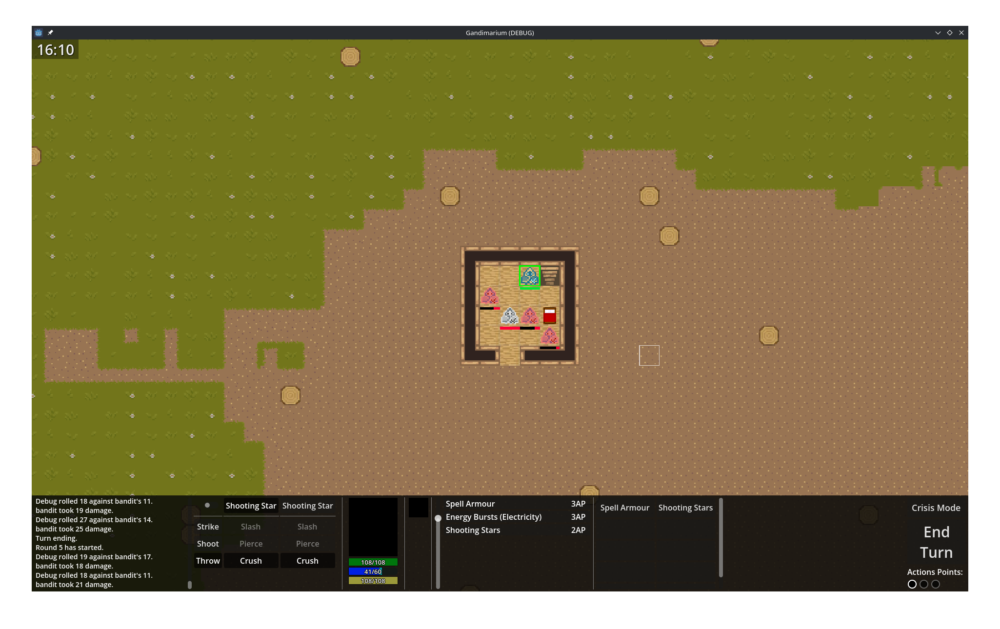
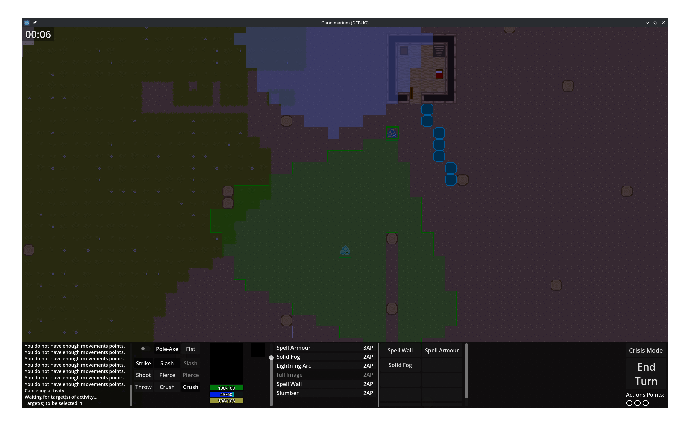
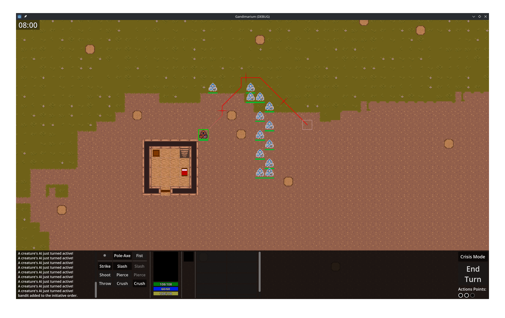
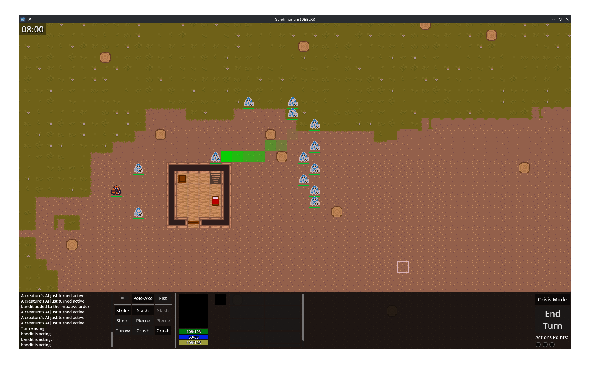

# Gandimarium

A 2D tile-based RPG built around deep simulation, autonomous NPC AI, and systemic world interaction. Ongoing active development.

---

## Overview

Gandimarium (working title) is a top-down 2D tile-based RPG with simulated 3D depth (à la Dwarf Fortress), built in Godot 4. The project's core focus is systemic depth: autonomous NPCs with individual goal-driven behavior, dynamic world simulation, procedural ownership and territory systems, and complex environment interaction mechanics. It began as a learning project and is now being developed toward an eventual commercial release.

## Tech Stack

- **Engine:** Godot 4.6 (GDScript, with hot paths planned in C++ or Rust)
- **Architecture:** Entity-component design with autoloaded global systems
- **AI:** Hybrid symbolic (algorithmic) AI — utility system, HTN (Hierarchical Task Networks), and GOAP (Goal-Oriented Action Planning)

## Features

- **Autonomous NPC AI** — Creatures act on individual goals and personalities via a layered AI system combining utility scoring, HTN-inspired task planning, and a GOAP-inspired top layer.
- **Deep environment interaction** — An exhaustive activity system (`Activity` class and children) with associated Filters, Effects, and Conditions supports highly complex world interaction and combat mechanics.
- **Procedural ownership and territory** — A tile-level ownership system maps all buildings and rooms, allowing creatures to claim, contest, and negotiate space based on relationships, authority, and resources.

## Roadmap

**AI & Simulation**

- Expand content in the lowest-level utility and HTN modules
- Build the GOAP-inspired world-map layer, feeding creature desires and needs into the local-map HTN layer
- Develop a memories and habits subsystem that tracks past events to produce distinct behavioral profiles over time; raw memories collapsing periodically into habits and general impressions, improving both performance and behavioral realism

**Social Systems**

- Develop social groups and organisations beyond their current basic implementation
- Implement a modular dialogue system where both the player and symbolic AI assemble semantic/pragmatic tags (opcodes) that are then expanded into full natural language utterances (leveraging LLMs to pre-generate a large amount of variations), with NPC reactions driven by personality parameters

**World & Meta-game**

- Build a world map with procedurally generated locations (design docs written), hand-modified for narratively significant sites

## AI Use

AI was used in a supporting role throughout development — primarily for code reviews, discussing industry standards and design patterns, and answering implementation questions. The vast majority of the codebase, architecture, and design decisions are my own.

For a small number of highly specialized, self-contained subsystems I have no intention of specializing in (such as shaders), AI-generated code was used directly.
These are clearly isolated from the core project logic.

This project began partly as a learning exercise, and AI interaction was a significant part of that process — using it as a sounding board to deepen understanding of the systems I was building from scratch, rather than as a shortcut around them.

## Getting Started

- Click "Start Game"
- Place your cursor on any tile and press "T" to spawn a controllable character.
- You may press "C" "I" and "S" for the different tabs of the character information window. There, you can change which items or abilities you want to become available to use.
- Move towards any other creature on the map and if they notice you (which you can avoid in various ways), they will automatically start a "Crisis", switch the game to turn-by-turn mode, and attempt to eliminate you.
- On your turns you may accomplish a number of different activities using Action Points (visible in the lower right corner), and "End Turn" when done.

## License

© Antoine Margoloff. All rights reserved. The source code is publicly visible for evaluation and reference purposes. Redistribution, modification, or commercial use without explicit written permission is prohibited.